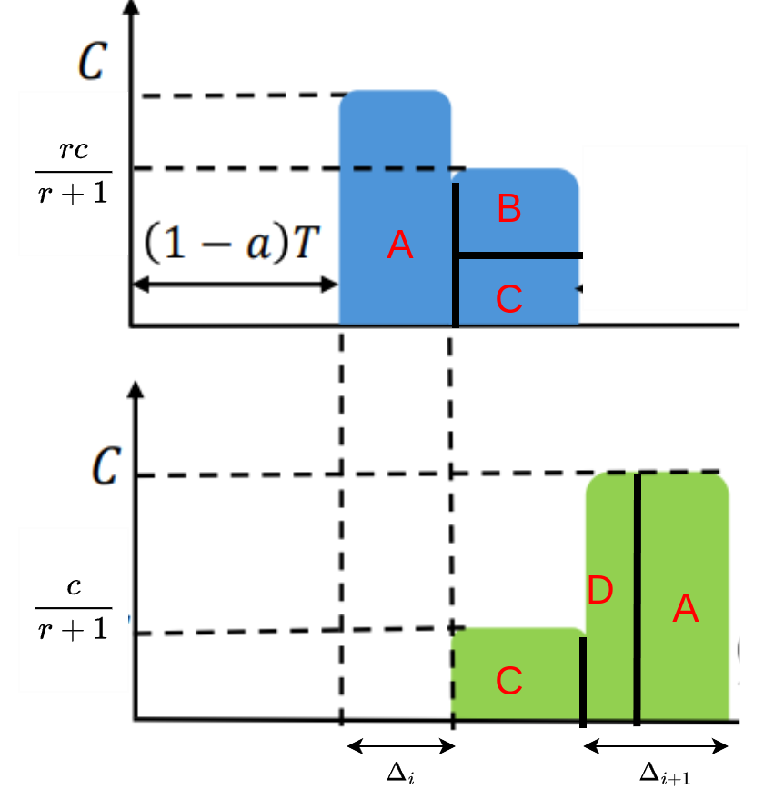

# Derivation of the Shift Equation (2) of MLTCP (HotNets'24)

## The Result
The shift equation in MLTCP explains how the start time differences (\( \Delta_i \)) between two jobs change as the MLTCP algorithm converges.

$$
\text{Shift}(\Delta_i) = \frac{\text{Slope} \cdot \Delta_i \cdot (a \cdot T - \Delta_i)}{a \cdot T \cdot \text{Intercept} + \Delta_i \cdot \text{Slope}}
$$

Where:
- \( \Delta_i \): Start time difference in iteration \( i \).
- \( T \): Total iteration time.
- \( a \): Fraction of the iteration spent in communication (\( 0 < a < 1 \)).
- \(\text{Slope}\) and \(\text{Intercept}\): Parameters of the bandwidth aggressiveness function below

$$
    F(\text{bytes\_ratio}) = \text{Slope} \cdot \text{bytes\_ratio} + \text{Intercept}
$$

---

## Derivation

||
|:-----------------------------------:|
| *Shifting of the communication pattern by MLTCP, taken from [MLTCP (HotNets'24)](https://doi.org/10.1145/3696348.3696878)* |

The figure below divides the communication pattern into smaller regions A, B, C, D. 

|{width=300px}|
|:-----------------------------------:|
| *Dividing the region in smaller chunks. Since the blue area equals the green area, B=D.* |

Since the jobs are identical, the difference between the end-times of the previous iteration would be the difference between the start-times in the next communication cycle. Thus the width of the green area $A+D$ is $\Delta_{i+1}$. 

Further, the blue area is equal to the green area, which represents the total number of bytes sent in the communication phase, given as $a \cdot T$ in the paper. Thus, removing the common areas A and C, we have $B=D$.

Notice that $D = c  \cdot \left(\Delta_{i+1} - \Delta_{i}\right) = c \cdot \text{Shift}(\Delta_i)$, where $c$ is the capacity of the bottleneck link. So, we would like to find the blue area $B$ to obtain $\text{Shift}(\Delta_i)$.

To find $B$, we must find the ratio $r$ of the bandwidth allotted to the blue flow to that of the green flow, in the overlapping region. From the MLTCP modification, we get that this ratio would be ratio of the aggression function 

$$ r = F_\text{blue}/F_\text{green} = \frac{\text{Slope} \cdot \text{bytes\_ratio}_\text{blue} + \text{Intercept}}{\text{Slope} \cdot \text{bytes\_ratio}_\text{green} + \text{Intercept}} $$

Since the green flow is just starting, its byte ratio is 0, while the blue flow has already transmitted $\Delta_i \cdot c$ out of a total of $a \cdot T$ bytes, making its bytes ratio as $\frac{\Delta_i \cdot c}{a \cdot T}$.

Thus the area of the region B equals 

$$
    \text{width} \cdot \text{height} = \left( \frac{a T c - \Delta_i c}{\frac{r}{r+1}c}\right)\left(\frac{r-1}{r+1} \cdot c\right) = \left( a \cdot T - \Delta_i\right)\left(\frac{r-1}{r} \cdot c\right)
$$
$$
= \frac{\text{Slope} \cdot \Delta_i \cdot (a \cdot T - \Delta_i)}{a \cdot T \cdot \text{Intercept} + \Delta_i \cdot \text{Slope}} c
$$

The width, above, is the number of bytes left for the blue flow by the link bandwidth used by the blue flow. Thus we have $$\text{Shift}(\Delta_i) = (\text{area}\ D) / c = (\text{area}\ B) / c = \frac{\text{Slope} \cdot \Delta_i \cdot (a \cdot T - \Delta_i)}{a \cdot T \cdot \text{Intercept} + \Delta_i \cdot \text{Slope}} $$

